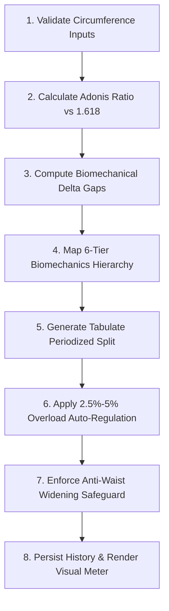

# Build Aesthetic Physique & V-Taper Engine

This skill provides step-by-step technical procedures, kinesiology rules, mathematical formulas, and UI templates for building and integrating an **Aesthetic Physique Blueprint & Adonis Golden Ratio ($\Phi = 1.618$) V-Taper Suite** into modern web applications.

---

## 1. When to Use This Skill

### ✅ Trigger When:
- User asks to "create an aesthetic physique calculator", "build a V-taper generator", "calculate Adonis index", or "optimize physique symmetry".
- User provides a biomechanics guide or workout blueprint emphasizing shoulder-to-waist ratios, lateral delt width, lat flaring, and waist minimization.
- User wants to periodize workouts based on length-tension curves, stretch-mediated hypertrophy, and auto-regulated progressive overload ($+2.5\%$ to $+5\%$).
- User asks to implement body proportion tracking, golden ratio silhouette meters, or anti-waist-widening core protocols.

### ❌ Do NOT Use When:
- The task is purely for raw powerlifting 1RM strength calculation without aesthetic/symmetry ratio targets.
- The request is solely for backend database migrations without UI, biomechanics, or ratio logic.
- The task is for general cardio or marathon endurance training with no V-Taper or hypertrophy requirements.

---

## 2. Step-by-Step Instructions

Follow this strict sequence when implementing or enhancing an Aesthetic Physique Engine:



### Step 1: Input Validation & Unit Normalization
1. Accept Shoulder, Waist, Chest, and Arm circumferences in either **Inches (`in`)** or **Centimeters (`cm`)**.
2. If `cm` is selected, convert to inches: $\text{inches} = \text{cm} / 2.54$.
3. Validate boundaries: $0 < \text{circumference} \le 100\text{ in}$. Reject negative or zero values.

### Step 2: Compute Adonis Golden Ratio & Classification
1. Compute the Adonis Ratio:
   $$\text{Adonis Ratio} = \frac{\text{Shoulders (in)}}{\text{Waist (in)}}$$
2. Classify into 5 distinct aesthetic tiers:
   - **$< 1.30$**: *Developing Taper (Foundation Phase)*
   - **$1.30 - 1.44$**: *Athletic Frame (Moderate Taper)*
   - **$1.45 - 1.54$**: *V-Taper Athletic (Strong Taper)*
   - **$1.55 - 1.61$**: *Near Adonis Target (High Aesthetic)*
   - **$\ge 1.618$**: *Golden Adonis Frame (Elite Symmetry)*

### Step 3: Compute Biomechanical Delta Roadmap
1. Calculate target shoulder width at current waist:
   $$\text{Target Shoulders} = \text{Waist} \times 1.618$$
   $$\Delta\text{Shoulders} = \text{Target Shoulders} - \text{Current Shoulders}$$
2. Calculate target waist size at current shoulders:
   $$\text{Target Waist} = \frac{\text{Current Shoulders}}{1.618}$$
   $$\Delta\text{Waist} = \text{Current Waist} - \text{Target Waist}$$

### Step 4: Implement 6-Tier Biomechanics Muscle Hierarchy
Always sequence exercise recommendations by leverage on the Adonis Ratio:
1. **Tier 1: Lateral Deltoids (The Width Anchor)**
   - *Primary Movement*: Cable Lateral Raises (constant tension), Seated DB Lateral Raises, Lean-Away Cable Raises.
   - *Cues*: Internal rotation bias (thumb-down), slight forward lean, `2-1-3` tempo, 1s peak pause.
2. **Tier 2: Lats (The Taper Driver)**
   - *Primary Movement*: Wide-Grip Lat Pulldowns / Pull-Ups (scapular plane adduction for width), Straight-Arm Pulldowns, Chest-Supported Rows.
   - *Cues*: Elbows down & back, passive grip, full overhead stretch non-negotiable.
3. **Tier 3: Upper Chest / Clavicular Pec (The Frame Filler)**
   - *Primary Movement*: Incline BB/DB Press ($30\text{--}45^\circ$), Low-to-High Cable Fly, Incline Machine Press.
   - *Cues*: $30\text{--}45^\circ$ bench angle, 3s eccentric, continuous tension without full lockout.
4. **Tier 4: Arms (Biceps & Triceps - The Detail Layer)**
   - *Primary Movement*: Incline DB Curls (long head stretched behind torso), Overhead Cable Triceps Extension (long head stretched overhead), Close-Grip Bench Press.
   - *Cues*: Prioritize stretch-mediated hypertrophy on long heads.
5. **Tier 5: Abdominals & Obliques (The Waist Illusion)**
   - *Primary Movement*: Hanging Leg Raises, Weighted Cable Crunches.
   - *Strict Rule*: Pure spinal flexion only. **Never prescribe heavy loaded side bends or heavy Russian twists.**
6. **Tier 6: Legs (Structural Balance - Non-Negotiable)**
   - *Primary Movement*: Full ROM Squats / Hack Squats below parallel, Romanian Deadlifts (slow hip hinge hamstring stretch), Walking Lunges.

### Step 5: Generate Tabulate-Style Periodized Splits
Provide 3 structured split levels:
- **Beginner (3-Day Split)**: Upper Width Foundation, Lower X-Frame Base, Arms & Details.
- **Intermediate (4-Day Split)**: Upper Width Heavy, Lower Quad Sweep, Upper Detail Hypertrophy, Posterior Chain & Calves.
- **Advanced (5-Day Split)**: High-Frequency Side Delt & Lat Overload, Quad Sweep & Core, Upper Chest Specialization, Posterior Chain, Arm Detail.

### Step 6: Apply 2.5% to 5% Progressive Overload Logic
1. Evaluate session performance:
   - If $\text{Reps Achieved} \ge \text{Target Top Reps}$ AND $\text{RPE} \le 8.0$:
     - Prescribe $+2.5\%$ to $+5\%$ (or $+1.25\text{ kg} - 2.5\text{ kg}$) load increase on the next session.
   - Else: Maintain current load until technical execution and top rep target are satisfied.
2. Volume landmarks: $10\text{--}20\text{ hard sets/muscle group/week}$ with Side Delts and Lats at the upper boundary.

---

## 3. Rules and Constraints

> [!IMPORTANT]
> 1. **Anti-Waist Widening Safeguard**: Heavy rotational or lateral oblique loading (e.g., heavy dumbbell side bends) must NEVER be recommended for aesthetic V-Taper goals.
> 2. **Golden Ratio Constant**: Always benchmark against $\Phi = 1.618$.
> 3. **Input Boundary Enforcement**: Never allow zero or negative inputs for body circumferences.
> 4. **Micro-Plate Increments**: For isolation lifts under $25\text{ kg}$ (e.g., lateral raises), use $+1.25\text{ kg}$ increments instead of coarse $+5\text{ kg}$ jumps.
> 5. **State Persistence**: All logged measurements must persist in local storage or database across browser reloads.

---

## 4. Output Template

When rendering or generating an Aesthetic Physique component or report, use this layout:

```markdown
# 🏛️ Aesthetic Physique Blueprint & Adonis Report

### 📐 Body Proportion Summary
- **Shoulders**: {shoulders} {unit}
- **Waist**: {waist} {unit}
- **Adonis Ratio**: **{calculated_ratio}** (Target: 1.618)
- **Status**: [{status_badge}]

### 🎯 Symmetry Roadmap
- **Upper Width Target**: Gain +{shoulder_delta} in on shoulders (Side Delts + Lat Width)
- **Waist Tightening Target**: Reduce -{waist_delta} in from waist via body fat optimization

### 🏋️ Prescribed Biomechanical Routine ({level})
| Target Group | Exercise | Sets × Reps | RPE Target | Tempo | Biomechanical Cue |
| :--- | :--- | :--- | :--- | :--- | :--- |
| Side Delts | Cable Lateral Raises | 4 × 12-15 | RPE 8.5 | 2-1-3 | Thumb-down bias, 1s peak pause |
| Lat Width | Wide-Grip Lat Pulldown | 4 × 8-10 | RPE 8.0 | 2-1-3 | Humerus adduction in scapular plane |
| Upper Chest | Incline DB Press (30°) | 4 × 8-10 | RPE 8.0 | 2-0-3 | 3s eccentric, no lockout |
```

---

## 5. Worked Example

### User Input:
- Shoulder Circumference: `48.0 in`
- Waist Circumference: `31.0 in`
- Experience Level: `Intermediate`

### System Output:
1. **Adonis Ratio**:
   $$\text{Ratio} = \frac{48.0}{31.0} = 1.548\quad (\text{V-Taper Athletic})$$
2. **Target Roadmap**:
   $$\text{Target Shoulders} = 31.0 \times 1.618 = 50.15\text{ in}\implies \Delta\text{Shoulders} = +2.15\text{ in}$$
   $$\text{Target Waist} = \frac{48.0}{1.618} = 29.67\text{ in}\implies \Delta\text{Waist} = -1.33\text{ in}$$
3. **Prescribed Split**: 4-Day Upper Width & Lower X-Frame Split with Cable Lateral Raises, Wide Pull-Ups, Incline DB Press, Hack Squats, Incline Curls, and Hanging Leg Raises.

---

## 6. Common Failure Modes & Mitigations

| Failure Mode | Root Cause | Prevention Strategy |
| :--- | :--- | :--- |
| **1. Prescribing Oblique Side Bends** | Using generic core routines instead of aesthetic-specific kinesiology. | Hardcode filter excluding heavy loaded side bends and twists; enforce flexion-only core (leg raises, cable crunches). |
| **2. Coarse Weight Jumps on Lateral Raises** | Standard $+2.5\text{ kg}$ progression per dumbbell exceeds lateral delt capacity. | Use $+1.25\text{ kg}$ micro-plates or rep progression ($12 \to 15$ reps) before increasing load. |
| **3. Zero or Negative Input Division** | User enters `0` or negative numbers causing `Infinity` or `NaN`. | Clamp inputs with `Math.max(0.1, waist)` and validate $0 < x \le 100\text{ in}$. |
| **4. Flat Bench vs. Incline Bias** | Emphasizing flat bench press over incline clavicular head. | Default upper chest pressing angle to $30^\circ\text{--}45^\circ$ with $3\text{s}$ controlled eccentric. |
