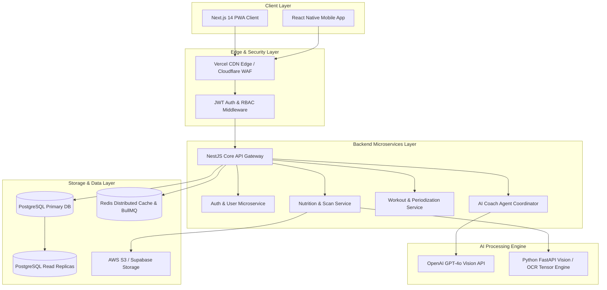
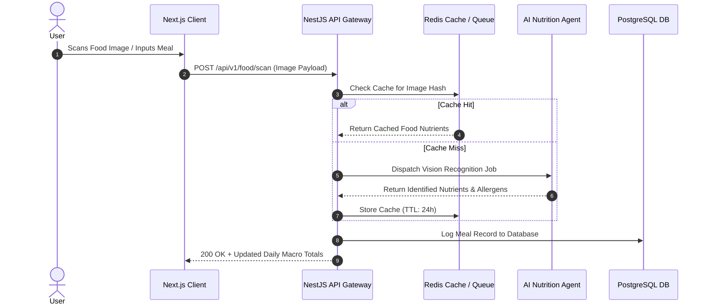
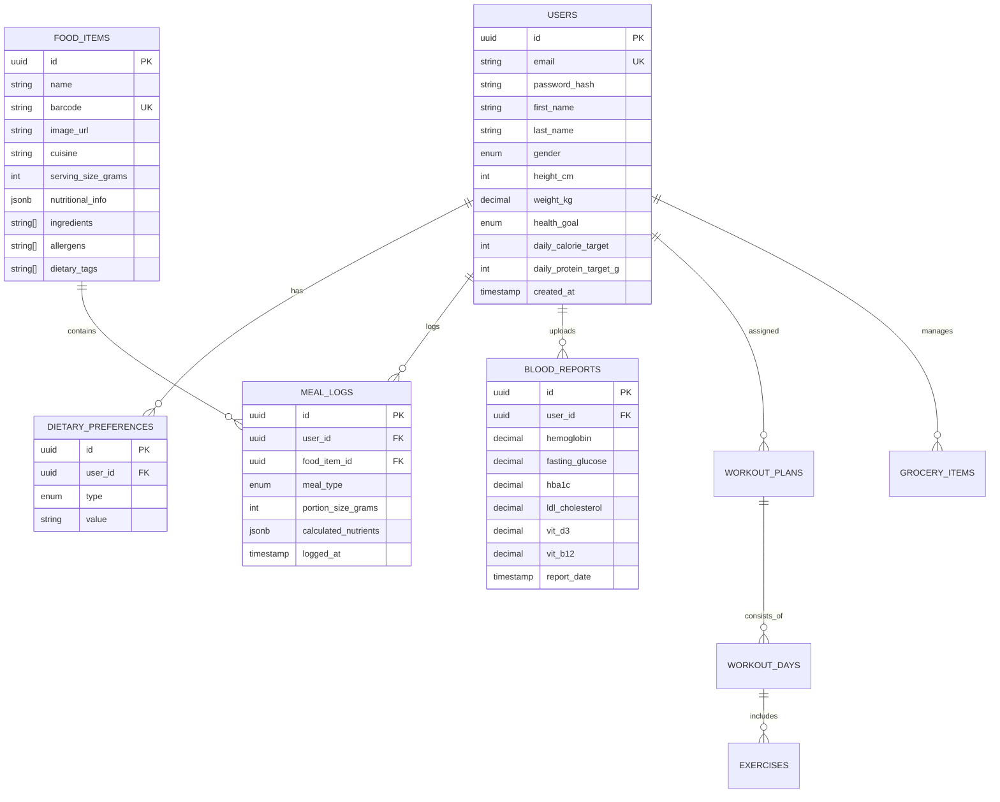

# Enterprise System Architecture Document — FitForge AI

## Table of Contents
1. [Executive Architecture Overview](#1-executive-architecture-overview)
2. [High-Level System Topology](#2-high-level-system-topology)
3. [Frontend Architecture](#3-frontend-architecture)
4. [Backend Architecture](#4-backend-architecture)
5. [AI Orchestration & Multi-Agent Engine](#5-ai-orchestration--multi-agent-engine)
6. [Authentication & Authorization (RBAC)](#6-authentication--authorization-rbac)
7. [Database Architecture & ER Schema](#7-database-architecture--er-schema)
8. [API Gateway, WebSockets & GraphQL](#8-api-gateway-websockets--graphql)
9. [Caching & Event Queue System](#9-caching--event-queue-system)
10. [Cloud Infrastructure & Deployment](#10-cloud-infrastructure--deployment)
11. [Security & Compliance Architecture](#11-security--compliance-architecture)
12. [Monitoring, Logging & Disaster Recovery](#12-monitoring-logging--disaster-recovery)

---

## 1. Executive Architecture Overview
FitForge AI is built on a high-availability, microservices-oriented event-driven architecture designed to support over 5 million concurrent active users with sub-200ms latency. The system leverages **Next.js 14 App Router** for the frontend, **NestJS / Node.js** microservices for the core API, **PostgreSQL with Prisma ORM** for transactional storage, **Redis** for distributed caching and BullMQ queue processing, and **Python FastAPI** for specialized AI tensor & vision models.

---

## 2. High-Level System Topology



---

## 3. Frontend Architecture

### 3.1 Stack
- **Framework**: Next.js 14 (App Router) + React 18
- **Language**: TypeScript 5.4+ (Strict Type Checking)
- **Styling**: Tailwind CSS + Custom Token Design System (`fitpro-design-system.md`)
- **Component Library**: shadcn/ui + Radix Primitives
- **State Management**: Zustand (App State) + TanStack React Query v5 (Server State Caching)
- **Data Visualization**: Recharts v2.15+
- **Icons**: Lucide React

### 3.2 Monorepo Directory Structure
```text
fitforge-ai/
├── apps/
│   ├── web/                        # Next.js 14 App Router client
│   │   ├── app/                    # Pages & Route Handlers
│   │   │   ├── (auth)/             # Login, Register, Password Reset
│   │   │   ├── (dashboard)/        # Dashboard, Analytics, Logs
│   │   │   ├── (scanner)/          # AI Camera & Barcode Scanner
│   │   │   ├── (coach)/            # AI Agent Chat & Workouts
│   │   │   └── api/                # Edge Next.js proxy endpoints
│   │   ├── components/             # Reusable UI components
│   │   │   ├── ui/                 # shadcn/ui primitive tokens
│   │   │   ├── scanner/            # Camera & Barcode overlays
│   │   │   ├── dashboard/          # Calorie rings, Macro bars
│   │   │   └── agents/             # Medical, Workout, Grocery components
│   │   ├── hooks/                  # Custom React hooks
│   │   └── stores/                 # Zustand stores
│   └── mobile/                     # React Native Expo App
├── packages/
│   ├── ui/                         # Shared UI token library
│   ├── config/                     # Shared ESLint, Prettier, Tailwind configs
│   └── types/                      # Shared TypeScript DTOs & Interfaces
├── services/                       # Microservices
│   ├── api-gateway/                # NestJS Core Gateway
│   ├── ai-vision-service/          # Python FastAPI OCR & Food Vision Engine
│   └── pdf-generator-service/      # Puppeteer / WeasyPrint PDF Service
└── docker-compose.yml
```

---

## 4. Backend Architecture

### 4.1 NestJS Microservices Core
- **Framework**: NestJS v10 + Express
- **ORM**: Prisma ORM v5 with PostgreSQL
- **Caching**: NestJS CacheManager + Redis
- **Queue System**: BullMQ for async background jobs (PDF generation, image analysis, email digests)
- **Validation**: Zod + class-validator with strict DTO schemas



---

## 5. AI Orchestration & Multi-Agent Engine

### 5.1 Specialized AI Agents
1. **User Profile Agent**: Analyzes biometrics, TDEE, activity level, and health targets.
2. **Medical Analysis Agent**: Evaluates blood lab reports (CBC, HbA1c, Lipids, Vit D3/B12) and generates health scores and medical safety triggers.
3. **Nutrition Agent**: Computes daily meal plans filtered by Budget (₹100 to ₹1000+/day), Cuisines, and Dietary Regimes (Vegan, Vegetarian, Jain, Keto, Low-GI).
4. **Workout Agent**: Generates adaptive periodized workout splits (Push/Pull/Legs, Upper/Lower) with RPE progressive overload adjustments.
5. **Supplement Agent**: Recommends evidence-based supplement stacks matched against lab deficiency flags.
6. **Grocery Agent**: Generates itemized weekly market shopping lists with local currency estimates.
7. **PDF Generator Agent**: Produces 1-click formatted printable PDF reports.

---

## 6. Authentication & Authorization (RBAC)

### 6.1 Security Strategy (`vibe_coded_auth_security_guide.md`)
- **Access Tokens**: Short-lived (15 minutes) JWT stored **strictly in application memory** (never in `localStorage` or `sessionStorage`).
- **Refresh Tokens**: Long-lived (7 days) HTTP-only, `Secure`, `SameSite=Strict` cookies with automatic token rotation.
- **Password Security**: Hashed with **Argon2id** (cost factor >= 10, salt length 16 bytes).
- **Role-Based Access Control (RBAC)**:
  - `ROLE_ADMIN`: Platform system management and audit logs.
  - `ROLE_TRAINER`: Personal trainer access to client dashboards and workout assignments.
  - `ROLE_NUTRITIONIST`: Clinical dietitian access to client blood reports and custom meal plans.
  - `ROLE_USER`: Standard subscriber access.

---

## 7. Database Architecture & ER Schema

### 7.1 Entity Relationship Model



---

## 8. API Gateway, WebSockets & GraphQL

### 8.1 API Endpoints Summary
- `POST /api/v1/auth/register`: User registration with Argon2id password hashing.
- `POST /api/v1/auth/login`: Authenticate and issue in-memory JWT + httpOnly cookie.
- `POST /api/v1/food/scan/image`: AI image recognition upload (multipart/form-data).
- `GET /api/v1/food/scan/barcode/:code`: Fast barcode nutritional lookup.
- `POST /api/v1/medical/analyze`: Upload blood report parameters for risk scoring.
- `GET /api/v1/workout/plan`: Fetch active adaptive workout split.
- `GET /api/v1/pdf/export/:type`: Stream formatted PDF reports.

---

## 9. Caching & Event Queue System
- **Distributed Cache**: Redis cluster caching frequent barcode queries, food database documents, and user session permissions (TTL 24 hours).
- **Asynchronous Task Queue**: BullMQ managing background tasks for PDF generation, email digests, and video frame feature extraction.

---

## 10. Cloud Infrastructure & Deployment
- **Frontend Hosting**: Vercel Global Edge Network.
- **Backend Microservices**: Docker containers orchestrated via AWS ECS Fargate or Kubernetes (EKS).
- **Database Service**: AWS RDS PostgreSQL with multi-AZ failover and read replicas.
- **Object Storage**: AWS S3 with KMS server-side encryption for user uploaded lab PDFs and food photos.

---

## 11. Security & Compliance Architecture
- **OWASP Compliance**: Automated Zod input validation, parameterized SQL queries via Prisma, CSP headers, rate-limiting (5 requests / 15 mins for auth routes).
- **Encryption**: AES-256 encryption at rest for database and S3 buckets; TLS 1.3 encryption in transit.

---

## 12. Monitoring, Logging & Disaster Recovery
- **Application Performance**: Datadog & Sentry for real-time exception tracking.
- **Infrastructure Metrics**: Prometheus & Grafana monitoring server CPU, memory, and database query latencies.
- **Disaster Recovery**: Automated point-in-time PostgreSQL database backups every 6 hours with a 15-minute Recovery Point Objective (RPO).
