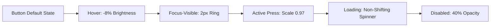
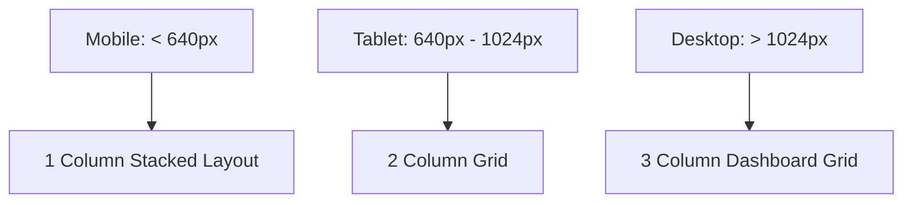

# FitForge AI Design System — Technical Specification

## Table of Contents
1. [Design Intent & Brand Identity](#1-design-intent--brand-identity)
2. [Design Tokens & Foundations](#2-design-tokens--foundations)
3. [Component-Level Specifications](#3-component-level-specifications)
4. [Accessibility Requirements (WCAG 2.1 AA)](#4-accessibility-requirements-wcag-21-aa)
5. [Responsive Layout & Grid System](#5-responsive-layout--grid-system)
6. [Motion & Animation Guidelines](#6-motion--animation-guidelines)
7. [Wireframe Layout Blueprints](#7-wireframe-layout-blueprints)

---

## 1. Design Intent & Brand Identity
Give engineering teams token-driven, state-complete UI rules for the **FitForge AI** mobile and web application surface, ensuring every button, link, list, input, card, and navigation element ships accessible, visually stunning, and responsive without local exceptions.

- **Theme**: Dark Mode default (`#0F172A` / `#000000`), glassmorphic panels, vibrant health green (`#10B981`), information blue (`#3B82F6`), and alert orange (`#F59E0B`).

---

## 2. Design Tokens & Foundations

### 2.1 Typography

| Token Name | Font Family | Size | Line Height | Intended Usage |
| :--- | :--- | :--- | :--- | :--- |
| `font.size.xs` | Acumin Pro / Montserrat | 9px | 12px | Timestamps, meta captions |
| `font.size.sm` | Acumin Pro / Open Sans | 11px | 14px | Secondary labels, helper text |
| `font.size.md` | Open Sans | 12px | 16px | Body text (default) |
| `font.size.lg` | Open Sans | 13px | 18px | Emphasized body, list item titles |
| `font.size.xl` | Montserrat | 14px | 20px | Card titles, section subheadings |
| `font.size.2xl` | Montserrat | 15px | 22px | Section headers |
| `font.size.3xl` | Montserrat | 16px | 24px | Screen titles |
| `font.size.4xl` | Montserrat | 20px | 28px | Hero calorie totals & stat numbers |

### 2.2 Semantic Color Tokens

| Token | Hex Value | Usage |
| :--- | :--- | :--- |
| `color.text.primary` | `#F8FAFC` | Primary text on dark surfaces |
| `color.text.secondary` | `#94A3B8` | Secondary labels & subtexts |
| `color.text.tertiary` | `#10B981` | Interactive elements, success states, green links |
| `color.text.inverse` | `#64748B` | Disabled / placeholder text |
| `color.surface.base` | `#090D16` | App background |
| `color.surface.muted` | `#1E293B` | Cards, list rows, input backgrounds |
| `color.brand.emerald` | `#10B981` | Primary CTA, health highlights |
| `color.brand.sky` | `#38BDF8` | Protein meters, workout tabs |
| `color.brand.amber` | `#FBBF24` | Calorie indicators, carb bars |
| `color.brand.rose` | `#FB7185` | Fat meters, allergen alerts |

### 2.3 Radius, Shadow & Motion Tokens
- `radius.xs`: **6px** (Cards, inputs)
- `radius.sm`: **50px** (Pill buttons, badges)
- `radius.md`: **100px** (Circular avatars, icon buttons)
- `shadow.1`: `0px 4px 20px -2px rgba(16, 185, 129, 0.15)` (Raised cards)
- `motion.duration.instant`: **200ms** (Micro-interactions, button presses)
- `motion.duration.fast`: **300ms** (Modal openings, tab switches)

---

## 3. Component-Level Specifications

### 3.1 Buttons
- **Anatomy**: Container → optional leading icon → label → optional trailing icon.
- **States Required**: Default, Hover, Focus-visible (2px outline), Active/Pressed (scale 0.97), Disabled (opacity 40%), Loading (inline spinner), Error (1px red border + alert text).
- **Touch Target**: Minimum **44×44px** hit area regardless of visual height.



### 3.2 Inputs & Forms
- **Anatomy**: Label → input field → helper/error message text → optional leading/trailing icon.
- **Rules**: Labels must remain persistent (never use placeholder-only labels). Errors must be announced via `aria-describedby`.

### 3.3 Food & Workout Cards
- **Anatomy**: High-resolution image header → confidence badge → category/cuisine pill → title → calorie/macro grid → allergen warning alert (if flagged).
- **Styling**: `glass-card` backdrop filter (`backdrop-blur-md`), 1px `slate-800` border, hover elevation.

---

## 4. Accessibility Requirements (WCAG 2.1 AA)

| Test Criterion | Pass Condition | Verification Method |
| :--- | :--- | :--- |
| **Color Contrast** | ≥4.5:1 for body text, ≥3.0:1 for large headings | Automated accessibility audit on token pairs |
| **Focus Visibility** | 2px ring with 2px offset on keyboard focus | Keyboard Tab navigation test |
| **Touch Targets** | Minimum 44×44px touch region | Computed bounding box inspection |
| **Color Independence** | No meaning conveyed by color alone | Grayscale screenshot audit |
| **Screen Readers** | All icon buttons carry `aria-label` | VoiceOver / NVDA audit |

---

## 5. Responsive Layout & Grid System



- **Mobile (< 640px)**: 1 column layout, fixed bottom navigation bar (`BottomNavigation.tsx`).
- **Tablet (640px - 1024px)**: 2 column layout, expanded header navbar.
- **Desktop (> 1024px)**: 3 column grid dashboard layout with sticky sidebars.

---

## 6. Motion & Animation Guidelines
- **Scanner Laser Beam**: `laserSweep` 2.2s linear infinite keyframe animation for camera & barcode scanning.
- **Pulse Effects**: `pulseSubtle` 3s for live AI thinking indicators.

---

## 7. Wireframe Layout Blueprints

### 7.1 Dashboard Screen Blueprint
```text
+-----------------------------------------------------------------------+
| [Logo: NutriScan & FITpro AI]    [Stats: 1850/2100 kcal]   [Scan] [Profile] |
+-----------------------------------------------------------------------+
| Sub-Nav: [Medical AI] [Workout AI] [Supplements] [Grocery] [Export PDF] |
+-----------------------------------------------------------------------+
|                                                                       |
|  +---------------------------+   +---------------------------------+  |
|  | Daily Calorie Budget Ring |   | Macronutrient Progress Target   |  |
|  |       1850 / 2100         |   | Protein:  110g / 120g  [====--] |  |
|  |      750 kcal Left        |   | Carbs:    190g / 210g  [====--] |  |
|  +---------------------------+   | Fats:      55g / 65g   [====--] |  |
|                                  +---------------------------------+  |
|                                                                       |
|  +-----------------------------------------------------------------+  |
|  | AI Health Coach Insight: "Add 150g grilled salmon for protein" |  |
|  +-----------------------------------------------------------------+  |
|                                                                       |
|  +-----------------------------------------------------------------+  |
|  | Today's Logged Meal Timeline                                     |  |
|  | [Img] Masala Dosa with Sambhar & Chutney      350g • 420 kcal [X] |  |
|  | [Img] Paneer Tikka Masala with Rice           400g • 560 kcal [X] |  |
|  +-----------------------------------------------------------------+  |
|                                                                       |
+-----------------------------------------------------------------------+
| Navigation:  [Dashboard]  [Meal Logs]  (( SCAN ))  [Analytics]  [Coach] |
+-----------------------------------------------------------------------+
```
