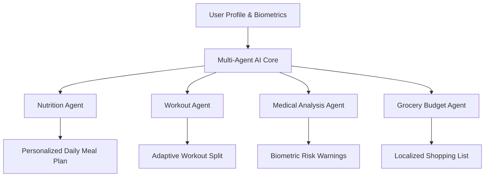
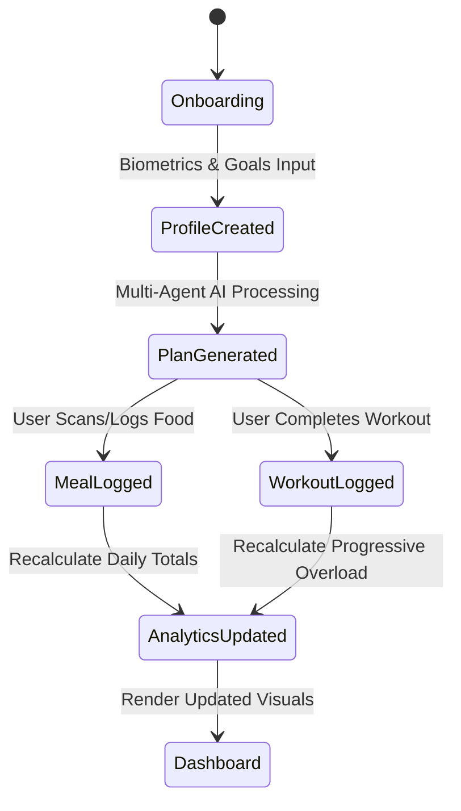

# Product Requirements Document (PRD) — FitForge AI

## Table of Contents
1. [Executive Summary](#1-executive-summary)
2. [Product Vision](#2-product-vision)
3. [Product Goals](#3-product-goals)
4. [Business Goals](#4-business-goals)
5. [Mission](#5-mission)
6. [Market Opportunity](#6-market-opportunity)
7. [Competitor Analysis](#7-competitor-analysis)
8. [User Personas](#8-user-personas)
9. [User Stories](#9-user-stories)
10. [Functional Requirements](#10-functional-requirements)
11. [Non-Functional Requirements](#11-non-functional-requirements)
12. [Acceptance Criteria](#12-acceptance-criteria)

---

## 1. Executive Summary
**FitForge AI** is an enterprise-grade, multi-agent AI fitness, nutrition, lifestyle, and health SaaS platform designed to deliver hyper-personalized physical transformation and wellness coaching to millions of users globally. By uniting automated meal planning, AI computer-vision food scanning, adaptive strength/hypertrophy workout generation, blood report biometric risk detection, localized budget meal planning, and real-time habit coaching into a unified Next.js + NestJS application, FitForge AI replaces fragmented apps (MyFitnessPal, Fitbod, Strong, Apple Fitness+) with a single, intelligent ecosystem.

---

## 2. Product Vision
To build the world's most intelligent, empathetic, and scientifically rigorous AI Personal Trainer, Nutritionist, and Lifestyle Coach — accessible to anyone, anywhere, on any device, regardless of fitness level or budget constraints.

---

## 3. Product Goals
- **Hyper-Personalization**: Generate 100% customized workout, nutrition, supplement, and habit plans within 5 seconds of user onboarding.
- **Biometric Intelligence**: Detect health risks and micro/macronutrient deficiencies directly from user blood reports and daily logs.
- **Budget Inclusivity**: Support daily meal plans optimized for budgets ranging from ₹100 ($1.20) to ₹1000+ ($12.00) per day across regional cuisines.
- **Engagement & Retention**: Achieve a 65%+ 30-day user retention rate through gamification, social challenges, and adaptive AI feedback loops.

---

## 4. Business Goals
- **Arr Growth**: Reach $10M ARR within 18 months through tiered SaaS subscriptions (Free, Pro, Elite Coach, Enterprise Gym/Trainer licenses).
- **Scale**: Support over 5,000,000 active monthly users (MAU) with sub-200ms API response times.
- **B2B Expansion**: Onboard 1,000+ certified personal trainers and gym owners via the FitForge Enterprise Dashboard.

---

## 5. Mission
Democratize elite health coaching by combining cutting-edge artificial intelligence, clinical nutrition science, and evidence-based exercise physiology into an accessible, intuitive platform.

---

## 6. Market Opportunity
The global digital fitness & wellness app market is projected to reach $25.9 Billion by 2030. Existing market offerings are siloed: MyFitnessPal excels at logging but lacks adaptive workout generation; Fitbod generates strength plans but ignores deep clinical nutrition and blood work; Apple Fitness+ provides static video content without personalized budget meal planning. FitForge AI captures this market whitespace through a unified multi-agent AI engine.

---

## 7. Competitor Analysis

| Competitor | Core Strengths | Critical Weaknesses | FitForge AI Advantage |
| :--- | :--- | :--- | :--- |
| **MyFitnessPal** | Massive food database, barcode scanner | Expensive paywalls, generic recommendations, no workout AI | Multi-agent AI meal & exercise generator, localized budget planner, blood work integration |
| **Fitbod** | Excellent muscle recovery tracking & weight selection | No nutrition features, no meal planning, subscription-only | Integrated diet, budget planner, OCR scanner, and live AI assistant |
| **Strong App** | Clean workout logger, custom routines | Zero AI coaching, manual data entry only | Automated adaptive periodization and real-time AI form/routine guidance |
| **Nike Training Club** | High-quality video library | Non-personalized, static plans, no nutrition tracking | Fully dynamic AI plan updates based on daily progress & recovery metrics |
| **Freeletics** | Bodyweight HIIT coach | High injury risk for beginners, poor strength customization | Multi-discipline support (Powerlifting, Bodybuilding, Calisthenics, Yoga, Rehab) |
| **Apple Fitness+** | Ecosystem integration, polished UI | Requires Apple Hardware, non-adaptive video feeds | Cross-platform PWA/Web/Mobile, personalized AI agent coaching |

---

## 8. User Personas

### 8.1 Beginner Persona — "Beginner Ben"
- **Age**: 24 | **Occupation**: Junior Software Engineer
- **Goal**: Start working out without feeling overwhelmed or intimidated.
- **Pain Point**: Doesn't know how to perform exercises safely or how much protein to eat.

### 8.2 Intermediate Persona — "Fitness Fiona"
- **Age**: 29 | **Occupation**: Marketing Manager
- **Goal**: Break through weight loss plateaus and tone muscle.
- **Pain Point**: Struggles with consistent meal prep and balancing social dining.

### 8.3 Advanced / Bodybuilder Persona — "Hypertrophy Hank"
- **Age**: 32 | **Occupation**: Physical Therapist
- **Goal**: Maximize muscle hypertrophy and track precise macro/micro ratios.
- **Pain Point**: Needs strict periodization and custom RPE/RIR weight logging.

### 8.4 Powerlifter Persona — "Barbell Bob"
- **Age**: 27 | **Occupation**: Mechanical Engineer
- **Goal**: Increase 1RM on Squat, Bench Press, and Deadlift.
- **Pain Point**: Existing apps don't support percentage-based strength periodization.

### 8.5 Calisthenics Athlete Persona — "Bodyweight Clara"
- **Age**: 22 | **Occupation**: Student
- **Goal**: Master muscle-ups, handstands, and planche progressions.
- **Pain Point**: Lack of bodyweight-specific progression models in general apps.

### 8.6 Martial Artist Persona — "Combat Chris"
- **Age**: 30 | **Occupation**: Security Specialist
- **Goal**: Improve rotational power, mobility, cardio endurance, and weight cutting.
- **Pain Point**: Needs sport-specific conditioning distinct from traditional bodybuilding.

### 8.7 Weight Loss User Persona — "Slimming Sam"
- **Age**: 38 | **Occupation**: Accountant
- **Goal**: Lose 20 kg safely while managing pre-diabetic blood sugar.
- **Pain Point**: Confused by crash diets; needs low-GI meal planning and fiber targets.

### 8.8 Weight Gain User Persona — "Bulking Brad"
- **Age**: 20 | **Occupation**: University Student
- **Goal**: Gain 8 kg of lean muscle on a tight student budget.
- **Pain Point**: High-calorie food cost; needs cheap high-protein meal options.

### 8.9 Busy Professional Persona — "Corporate Priya"
- **Age**: 35 | **Occupation**: Executive VP
- **Goal**: Stay fit with quick 30-minute home/hotel workouts and quick meal options.
- **Pain Point**: Zero time for long gym sessions or complex cooking recipes.

### 8.10 Student Persona — "Budget Dev"
- **Age": 21 | **Occupation**: Undergraduate
- **Goal**: Maintain fitness on a ₹150 ($1.80)/day food budget.
- **Pain Point**: Expensive protein supplements; needs cheap whole food alternatives (Eggs, Soya, Chana).

### 8.11 Women’s Health Persona — "Wellness Maya"
- **Age**: 31 | **Occupation**: Architect
- **Goal**: Align workout intensity and nutrition with menstrual cycle phases and PCOS management.
- **Pain Point**: Hormone fluctuations impacting energy and water retention.

### 8.12 Senior Citizen Persona — "Active Arthur"
- **Age**: 64 | **Occupation**: Retired Educator
- **Goal**: Improve joint mobility, balance, and maintain bone density.
- **Pain Point**: Joint pain; requires low-impact exercises and high-contrast UI font sizing.

### 8.13 Personal Trainer Persona — "Coach Marcus"
- **Age**: 34 | **Occupation**: Certified CSCS Trainer
- **Goal**: Manage 40+ client plans, track compliance, and generate professional PDF reports.
- **Pain Point**: Manual client tracking consumes 15+ hours weekly.

### 8.14 Gym Owner Persona — "Facility Frank"
- **Age**: 45 | **Occupation**: Commercial Gym Owner
- **Goal**: Provide branded digital coaching app access to 500+ gym members.
- **Pain Point**: Member retention drop-offs after initial onboarding.

### 8.15 Nutritionist Persona — "Dietitian Deepa"
- **Age**: 36 | **Occupation**: Clinical Nutritionist
- **Goal**: Review client blood reports, set custom macro/micro guardrails, and track food logs.
- **Pain Point**: Inaccurate self-reported meal intake from clients.

### 8.16 System Administrator — "Admin Alex"
- **Age**: 33 | **Occupation**: Lead DevOps & Security Engineer
- **Goal**: Monitor platform health, manage role-based permissions, and audit compliance.
- **Pain Point**: Preventing unauthorized API access and ensuring 99.99% uptime.

---

## 9. User Stories

### 9.1 Authentication & Onboarding
- **US-001**: As a new user, I want to sign up using Google, Apple, or Email/Password, so that I can create an account in under 10 seconds.
- **US-002**: As a user, I want a guided onboarding wizard to input my biometrics (age, height, weight, activity level, fitness goal), so that the AI can calculate my TDEE and baseline macros.
- **US-003**: As a user with food allergies, I want to select specific allergens (Peanuts, Dairy, Gluten, Shellfish, Soy, Nightshades) during onboarding, so that the meal planner never suggests unsafe meals.

### 9.2 AI Coaching & Workouts
- **US-004**: As a strength athlete, I want the AI to generate a custom 4-day Upper/Lower workout split based on my available equipment (Barbell, Dumbbells, Cables), so that I can train effectively at my gym.
- **US-005**: As a busy user, I want to toggle a "30-Minute Home Workout" filter, so that I receive quick bodyweight and band routines when traveling.
- **US-006**: As a lifter, I want to log completed weight, sets, reps, and RPE for each exercise, so that the AI can adjust my weights next week using progressive overload.

### 9.3 AI Diet & Budget Planning
- **US-007**: As a budget-conscious user, I want to set a daily food budget (e.g. ₹150/day or $5/day), so that the AI generates high-protein meal plans using affordable local ingredients.
- **US-008**: As a user scanning packaged food, I want to point my camera at a barcode, so that the app instantly retrieves exact calories, macros, net carbs, and ingredient warnings.
- **US-009**: As a user reviewing lab reports, I want to upload my blood test PDF, so that the AI detects Vitamin D3/B12 deficiencies and updates my supplement and diet recommendations.

### 9.4 Community & Progress Tracking
- **US-010**: As a motivated user, I want to earn gamified badges and climb weekly leaderboards, so that I stay consistent with my workouts.
- **US-011**: As a client, I want to export my monthly diet and workout summary as a professional PDF report, so that I can share it with my doctor or coach.

---

## 10. Functional Requirements

### 10.1 Multi-Agent AI Core & Coaching Assistant
- **FR-01**: Multi-agent pipeline coordinating Nutrition Agent, Workout Agent, Medical Analysis Agent, Grocery Agent, and PDF Export Agent.
- **FR-02**: Real-time conversational AI Health Assistant supporting voice-to-text queries and natural language prompt chips.

### 10.2 Adaptive Workout Generator & Exercise Library
- **FR-03**: Support 1,000+ exercise definitions with HD video clips, primary/secondary muscle maps, step-by-step instructions, and common mistake warnings.
- **FR-04**: Dynamic weight periodization supporting RPE (Rating of Perceived Exertion), RIR (Reps in Reserve), and % 1RM calculations.

### 10.3 AI Diet, Budget & Barcode Scanner Engine
- **FR-05**: Automated meal plan generation filtered by Budget (₹100 to ₹1000+/day), Cuisines (Indian, Global, Asian, Mediterranean), Dietary Regimes (Vegan, Vegetarian, Jain, Keto, Low-GI), and Allergies.
- **FR-06**: Integrated Barcode Scanner & OCR Nutrition Label Scanner fetching USDA & ICMR-NIN verified nutritional databases.

### 10.4 Progress Analytics & Biometric Tracking
- **FR-07**: Daily Calorie Budget ring, Macronutrient Donut chart, Weekly trend bar chart, and Micronutrient RDA gauges (Vitamins A, C, D, B12, Iron, Calcium, Potassium, Sodium).
- **FR-08**: Body measurement tracker (Weight, Body Fat %, Chest, Waist, Arms, Thighs) with visual trend graphs.

### 10.5 PDF Export & Enterprise Dashboards
- **FR-09**: 1-Click export of print-ready PDF reports for Diet Plans, Workout Schedules, Grocery Lists, and Medical Analyses.
- **FR-10**: Enterprise Client Management Portal for Personal Trainers and Gym Owners to manage client compliance, custom plans, and messaging.

---

## 11. Non-Functional Requirements

### 11.1 Performance & Response Time
- **NFR-01**: API response times must remain under 200ms for 95% of standard requests.
- **NFR-02**: AI Plan Generation pipeline must deliver complete meal & workout splits in < 4.0 seconds.

### 11.2 Security & Compliance
- **NFR-03**: Full compliance with **OWASP Top 10** standards (JWT in-memory, SameSite=Strict refresh cookies, sanitized ORM inputs, rate limiting).
- **NFR-04**: Compliance with **GDPR** & **HIPAA** guidelines for encrypted storage of biometric and medical lab reports at rest (AES-256) and in transit (TLS 1.3).

### 11.3 Availability & Scalability
- **NFR-05**: System availability target of 99.99% uptime with auto-scaling Docker/Kubernetes container orchestration.
- **NFR-06**: Support horizontal database scaling via PostgreSQL read replicas and Redis caching.

---

## 12. Acceptance Criteria

- **AC-01 (Onboarding)**: Onboarding must complete in 3 steps or fewer; upon submission, TDEE and recommended macros must be displayed instantly.
- **AC-02 (Barcode Scanning)**: Valid product barcodes must return food details, calories, macros, and allergen warnings within 1.0 second.
- **AC-03 (Allergen Safeguards)**: If a user has a flagged allergy (e.g. Dairy), any scanned or generated dish containing dairy ingredients must trigger a visible high-contrast warning banner before meal logging.
- **AC-04 (PDF Export)**: Exported PDF documents must be cleanly formatted for A4 print layout, displaying all user biometrics, meal schedules, and exercise tables without text overlap.
