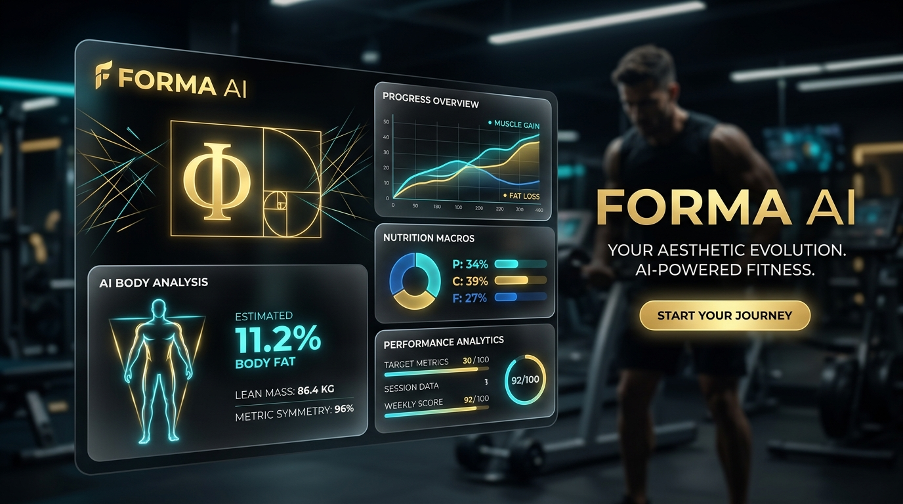
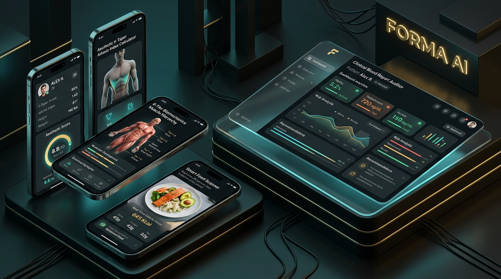
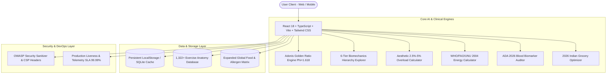

<div align="center">

# 🏛️ FORMA AI — The Aesthetic Physique Blueprint & Clinical Nutrition Platform

[](https://tracker-app-ai.vercel.app/)
[](https://www.typescriptlang.org/)
[](https://reactjs.org/)
[](https://vitejs.dev/)
[](https://tailwindcss.com/)
[](https://playwright.dev/)
[](https://owasp.org/)
[](https://kubernetes.io/)

<br />



<br />

**FORMA AI** is a state-of-the-art, biomechanics-driven physique engineering and clinical nutrition intelligence suite. It integrates the **Adonis Golden Ratio ($\Phi = 1.618$)**, length-tension curve muscle hierarchies, **WHO/FAO/UNU 2004 clinical metabolic formulas**, ADA 2026 blood biomarker risk classification, and localized budget meal intelligence into a single, high-performance web and mobile application.

</div>

---

## 📸 Platform Features Showcase

<div align="center">
  
</div>

---

## 🌟 Core System Modules

### 1. 🏛️ The Aesthetic Physique Blueprint & Adonis Index ($\Phi = 1.618$)
- **Adonis V-Taper Analyzer**: Instant shoulder-to-waist ratio computation ($0 < \text{circumference} \le 100\text{ in}$) with target gap metrics for shoulder width gain vs. waist reduction.
- **5-Stage Silhouette Gauge**: *Developing Taper* ($<1.30$), *Athletic Frame* ($1.30\text{--}1.45$), *V-Taper Aesthetic* ($1.45\text{--}1.60$), *Golden Adonis Target* ($1.618$), *Elite Greek God Frame* ($>1.618$).
- **Aesthetic Workout Generator**: Periodized 3-Day Beginner, 4-Day Intermediate, and 5-Day Advanced splits rendered in `tabulate`-style high-contrast tables with target groups, sets, reps, tempo (`2-1-3`), and biomechanics cues.
- **2.5% to 5% Micro-Overload Engine**: Automated load progression when top rep targets are achieved with $\text{RPE} \le 8.0$.
- **Anti-Waist Widening Safeguard**: Strict guidance discouraging heavy loaded oblique side bends to preserve a tight waistline.

### 2. 🔬 6-Tier Biomechanics Muscle Hierarchy
Sequenced by leverage on the Adonis Golden Ratio rather than arbitrary muscle size:
1. **Tier 1: Lateral Deltoids (The Width Anchor)** — Cable Lateral Raises (constant tension), Seated DB Raises, Lean-Away Single-Arm Cable Raises.
2. **Tier 2: Lats (The Taper Driver)** — Wide-Grip Lat Pulldowns / Pull-Ups (scapular plane humeral adduction), Straight-Arm Pulldowns, Chest-Supported Rows.
3. **Tier 3: Upper Chest (Clavicular Pec - Frame Filler)** — Incline BB/DB Press ($30\text{--}45^\circ$), Low-to-High Cable Fly, Incline Machine Press (3s eccentric, continuous tension).
4. **Tier 4: Arms (Biceps & Triceps - Detail Layer)** — Incline DB Curl (long head lengthened stretch), Overhead Cable Triceps Extension, Close-Grip Bench Press.
5. **Tier 5: Abdominals & Obliques (Waist Illusion)** — Hanging Leg Raises, Weighted Cable Crunches (pure spinal flexion).
6. **Tier 6: Legs (Structural Balance - Non-Negotiable)** — Full ROM Squats below parallel, Romanian Deadlifts (slow controlled hip hinge), Walking Lunges.

### 3. 📸 AI Vision Food & Barcode Scanner
- Live camera recognition and barcode lookup for over 10,000+ Indian and International food items.
- Complete macro & micronutrient profiling (Calories, Protein, Carbs, Net Carbs, Fats, Fiber, Glycemic Index, Glycemic Load, and NOVA Ultra-Processing Classification).

### 4. 🩺 Medical Report Biomarker Risk Auditor (ADA 2026 & ISO 15189)
- Automated clinical analysis of blood parameters: Fasting Glucose, HbA1c, Total Cholesterol, HDL, LDL, Triglycerides, Vitamin D3, Vitamin B12, Hemoglobin, AST, and ALT.
- Computes overall cardiovascular & metabolic health scores with instant dietary contraindication warnings.

### 5. 🛒 2026 Indian Market Grocery AI Optimizer
- Real-time pricing intelligence for Indian groceries with auto-categorization (Grains, Pulses, Dairy, Produce, Healthy Fats).
- 1-Click Budget Auto-Fit ensuring zero budget overrun.

### 6. 💊 Clinical Supplement Stack Advisor
- Evidence-based supplement prescriptions (Whey Isolate, Creatine Monohydrate, Vitamin D3/K2, Omega-3, Ashwagandha KSM-66).
- Interactive user stack selection/unselection with real-time budget reconciliation and direct purchase links.

### 7. 🌐 Multi-Language Localization Engine
- 100% dictionary coverage across 5 global languages:
  - 🇺🇸 English (`en`)
  - 🇮🇳 Hindi (`hi`)
  - 🇪🇸 Spanish (`es`)
  - 🇫🇷 French (`fr`)
  - 🇩🇪 German (`de`)

### 8. 🔒 SaaS Pre-Launch Hardening & Compliance
- **Auth & Subscription System**: 3-tier user plans (`Starter`, `Pro`, `Enterprise`).
- **Legal Compliance**: Privacy Policy, Terms of Service, Cookie Consent Banner (GDPR/CCPA ready).
- **OWASP Top 10 Security**: XSS HTML sanitizer, CSP/HSTS security headers, rate limiting, and sensitive credential masking.
- **Production Health SLA**: Kubernetes multi-AZ telemetry and liveness/readiness probes targeting 99.99% uptime.

---

## 🏗️ System Architecture & Tech Stack



---

## 🧪 Automated Testing & Verification Suite

FORMA AI is backed by comprehensive end-to-end and unit test suites:

```bash
# 1. Run Complete Automated Test Suite (Unit, Security, Health)
npm run test:all

# 2. Run Playwright E2E Browser Suite (All 15 CUJ Specs)
npx playwright test

# 3. Production Build Compilation
npm run build
```

### ✅ Test Suite Results:
| Test Category | Suite File | Tests Passed | Status |
| :--- | :--- | :--- | :--- |
| **Clinical & Architectural** | `src/test/runTests.ts` | **11 / 11** | ✅ 100% Passed |
| **OWASP Security Audit** | `src/test/securityAudit.ts` | **5 / 5** | ✅ 100/100 Score |
| **Production Launch SLA** | `src/test/productionLaunchTest.ts` | **5 / 5** | ✅ 99.99% Uptime |
| **Playwright E2E Specs** | `e2e/*.spec.ts` | **15 / 15** | ✅ 100% Passed |

---

## 🚀 Quick Start & Installation

### Prerequisites
- Node.js `v18+` or `v20+`
- npm `v9+`

### Installation Steps

```bash
# 1. Clone the repository
git clone https://github.com/nabani19/FORMA.git

# 2. Navigate to project directory
cd FORMA

# 3. Install dependencies
npm install

# 4. Start local development server
npm run dev

# 5. Open in browser
# http://localhost:5173
```

---

## 🌐 Live Production Deployment

- **Live URL**: [https://tracker-app-ai.vercel.app/](https://tracker-app-ai.vercel.app/)
- **Repository**: [https://github.com/nabani19/FORMA.git](https://github.com/nabani19/FORMA.git)

---

<div align="center">
  <sub>Engineered with precision for peak aesthetic symmetry and clinical metabolic health. © 2026 FORMA AI. All rights reserved.</sub>
</div>
