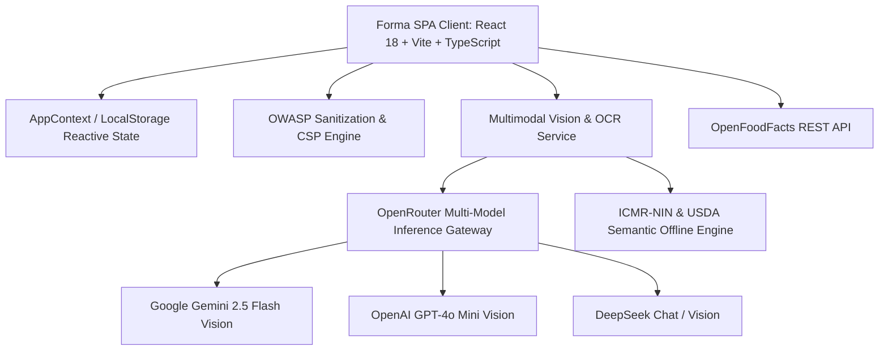

# 2-TRD.md — Technical Requirements Document

> **Forma (FitForge AI)**: Architecture, Tech Stack, Vision Models, Security Standards, and API Specifications.

---

## 1. System Architecture & Technology Stack

### Core Frontend Stack
- **Framework**: React 18 (Concurrent Mode, Hooks, Memoization)
- **Build Tool**: Vite 5.x (Sub-second HMR, Tree-Shaking, ES2022 Target)
- **Language**: TypeScript 5.x (Strict mode enabled, zero `any` policy for core data)
- **Styling**: Tailwind CSS + Custom CSS Variables + Responsive Dark/Light Engine
- **Icons**: Lucide React
- **Audio & Media**: HTML5 MediaDevices API, Canvas Frame Extraction, Web Audio API

---

## 2. Multimodal AI Vision & OCR Architecture
- **Inference Gateway**: OpenRouter API (`https://openrouter.ai/api/v1/chat/completions`)
- **Primary Vision Model**: `google/gemini-2.5-flash`
- **Fallback Candidates**: `openai/gpt-4o-mini`, `deepseek/deepseek-chat`
- **Offline Fallback Engine**: Local indexed semantic search over 100+ ICMR-NIN & USDA clinical nutrient records.
- **OCR Engine**: Vision-based structured JSON extraction parsing serving weight, calories, macronutrients, saturated fat, sodium, fiber, sugars, and micronutrients.

---

## 3. Barcode & Product Verification Engine
- **Global Barcode Database**: OpenFoodFacts API (`https://world.openfoodfacts.org/api/v0/product/{barcode}.json`)
- **Formats Supported**: EAN-13, EAN-8, UPC-A, UPC-E
- **Client-Side Caching**: Memory map + LocalStorage caching with 24-hour TTL.

---

## 4. Security & Hardening (OWASP Top 10)
- **Input Sanitization**: Strict HTML entity decoding and tag stripping (`DOMPurify` / `stripHtml`).
- **HTTP Security Headers**:
  - `Content-Security-Policy`: Strict script-src and connect-src policies
  - `Strict-Transport-Security`: `max-age=31536000; includeSubDomains; preload`
  - `X-Content-Type-Options`: `nosniff`
  - `X-Frame-Options`: `DENY`
  - `Referrer-Policy`: `strict-origin-when-cross-origin`
- **Zero Sensitive Data Exposure**: API keys stored in local memory / encrypted browser storage.

---

## 5. Deployment & Production Infrastructure
- **Cloudflare Pages**: High-speed edge CDN distribution with `wrangler.toml` and SPA routing rewrite rules (`/* /index.html 200`).
- **Docker / Kubernetes**: Multi-stage lightweight Alpine Nginx image with liveness probe (`/healthz`) and readiness probe (`/ready`).
