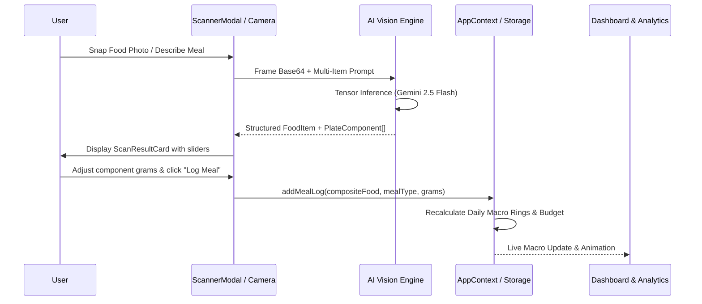

# 3-Architecture.md — System Architecture & Component Hierarchy

> **Forma (FitForge AI)**: Component structure, data pipelines, state management, and isolation boundaries.

---

## 1. Directory Structure & Module Boundaries

```
src/
├── components/          # Reusable UI & Modal components
│   ├── ScannerModal.tsx       # 5-Tab Vision, OCR & Barcode modal
│   ├── ScanResultCard.tsx     # Decomposed plate & portion adjustment card
│   ├── Dashboard.tsx          # Real-time macro progress rings & budget overview
│   ├── WorkoutView.tsx        # 1,000+ Exercise & Overload Periodizer
│   ├── AestheticPhysiqueView.tsx # Adonis Golden Ratio & 6-Tier engine
│   ├── MedicalReportView.tsx  # Blood Biomarkers & Risk analysis
│   ├── MealHistoryView.tsx    # 5-Meal timeline & logged entries
│   ├── BudgetSettingsPanel.tsx# Monthly/Daily INR budget controller
│   ├── GroceryPlannerView.tsx # Auto-generated smart shopping lists
│   └── SupplementAdvisor.tsx  # Evidence-based supplement engine
├── context/
│   └── AppContext.tsx         # Central reactive state container
├── data/
│   ├── mockFoodDatabase.ts    # ICMR-NIN & USDA verified food catalogs
│   └── exerciseDatabase.ts    # 1,000+ Head-to-toe exercise taxonomy
├── types/
│   └── index.ts               # Core TypeScript interface definitions
├── utils/
│   ├── aiVisionService.ts     # Multimodal Vision, Label OCR & Hand-Portion conversion
│   ├── aiService.ts           # OpenRouter key management & multi-model router
│   ├── whoFormulas.ts         # Clinical WHO/FAO BMR & TDEE calculators
│   ├── securityEngine.ts      # OWASP XSS sanitizer & Security headers
│   ├── k8sHealth.ts           # Kubernetes telemetry & liveness probes
│   ├── i18n.ts                # 5-Language localization dictionaries
│   └── nutritionUtils.ts      # Macro balance, budget & recipe helpers
└── test/
    └── runTests.ts            # Complete 16-test clinical verification suite
```

---

## 2. Unidirectional Data Flow & State Lifecycle



---

## 3. Resilience & Error Handling Strategy
1. **Network Interruption**: Seamlessly routes AI calls to local indexed ICMR-NIN and USDA database matches.
2. **Camera Denial**: Gracefully displays fallback file upload dropzone and conversational meal prompt.
3. **Corrupted Storage**: Automatic schema migration and fallback initialization to safe default user state.
