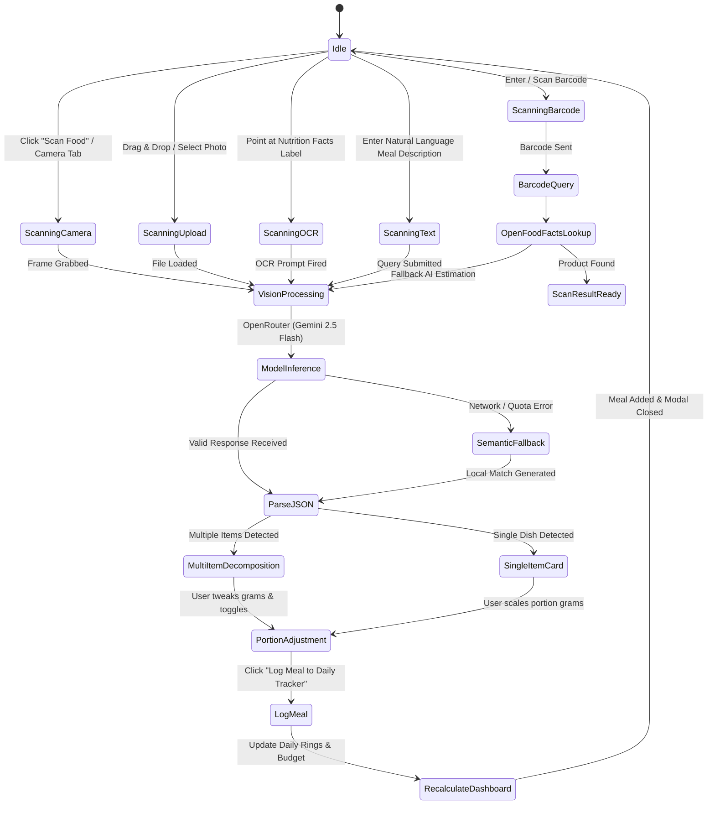

# 6-App-Flow-Document.md — Application State Machine & User Journeys

> **Forma (FitForge AI)**: End-to-end user navigation flows, state machines, and lifecycle transitions.

---

## 1. Complete Food Scanning & Logging State Machine

---

## 2. Daily User Journeys

### Journey A: Scanning a Complex Indian Thali
1. User taps "Scan Food" floating button on Dashboard.
2. User snaps photo of plate containing *Paneer Butter Masala, 2 Rotis, Jeera Rice, and Salad*.
3. AI Vision engine detects multi-item plate, deconstructs the 4 items, and displays each with a gram slider.
4. User reduces rice slider from 150g to 100g.
5. User clicks "Log Composite Plate to Daily Tracker".
6. Dashboard macros and meal timeline instantly update with zero lag.

### Journey B: Scanning a Protein Bar / Packaged Snack (OCR)
1. User selects "Label OCR" tab in Scanner.
2. User captures printed Nutrition Facts table on packaging.
3. OCR engine extracts exact manufacturer numbers (20g protein, 2g sugar, 210 kcal).
4. User logs snack under "Morning Snack" slot.

### Journey C: Medical Blood Lab Integration & Risk Triggers
1. User navigates to "Medical Lab Diagnostics" view.
2. User enters Fasting Glucose: 110 mg/dL and HbA1c: 5.9%.
3. System triggers ADA 2026 Pre-Diabetes Alert with recommended low-glycemic dietary regime and automated meal plan adjustment.
